# Архитектура проекта Bitrix24 WebRTC SIP Phone

## Общее описание

Проект представляет собой интеграцию WebRTC SIP телефонии с системой Bitrix24. Приложение позволяет пользователям Bitrix24 совершать и принимать звонки через SIP-провайдера непосредственно из интерфейса Bitrix24.

## Стек технологий

### Backend
- **NestJS** - основной фреймворк
- **TypeORM** - ORM для работы с базой данных
- **PostgreSQL** - реляционная база данных
- **node-vault** - клиент для работы с HashiCorp Vault
- **Axios** - HTTP клиент для взаимодействия с Bitrix24 API

### Frontend
- **Vanilla JavaScript** - основной язык
- **SIP.js** - WebRTC SIP стек
- **Vite** - сборщик и dev-сервер
- **Bitrix24 JS SDK** - для интеграции с Bitrix24

### Infrastructure
- **Docker & Docker Compose** - контейнеризация
- **NGINX** - reverse proxy и SSL termination
- **HashiCorp Vault** - управление секретами

---

## Архитектура системы

### Общая схема компонентов

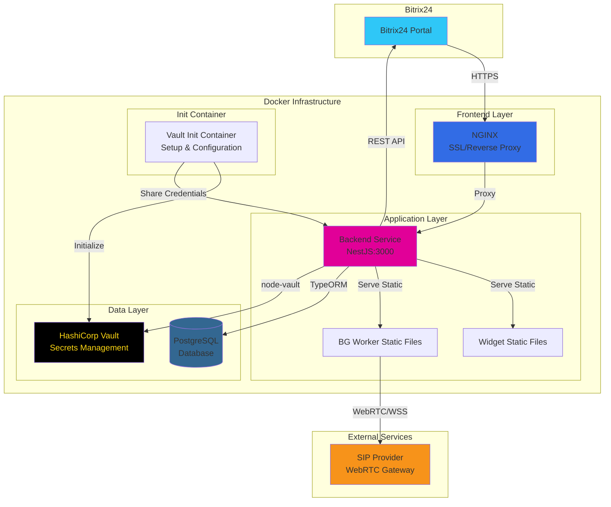
```mermaid
graph TB
    subgraph "Bitrix24"
        B24[Bitrix24 Portal]
    end
    
    subgraph "Docker Infrastructure"
        subgraph "Frontend Layer"
            NGINX[NGINX<br/>SSL/Reverse Proxy]
        end
        
        subgraph "Application Layer"
            Backend[Backend Service<br/>NestJS:3000]
            StaticWidget[Widget Static Files]
            StaticBG[BG Worker Static Files]
        end
        
        subgraph "Data Layer"
            PG[(PostgreSQL<br/>Database)]
            Vault[HashiCorp Vault<br/>Secrets Management]
        end
        
        subgraph "Init Container"
            VaultInit[Vault Init Container<br/>Setup & Configuration]
        end
    end
    
    subgraph "External Services"
        SIP[SIP Provider<br/>WebRTC Gateway]
    end
    
    B24 -->|HTTPS| NGINX
    NGINX -->|Proxy| Backend
    Backend -->|Serve Static| StaticWidget
    Backend -->|Serve Static| StaticBG
    Backend -->|TypeORM| PG
    Backend -->|node-vault| Vault
    VaultInit -->|Initialize| Vault
    VaultInit -->|Share Credentials| Backend
    StaticBG -->|WebRTC/WSS| SIP
    Backend -->|REST API| B24
    
    style NGINX fill:#326CE5
    style Backend fill:#E10098
    style PG fill:#336791
    style Vault fill:#000000,color:#FFD814
    style B24 fill:#2FC7F7
    style SIP fill:#F7931A
```

---

## Архитектура Backend (NestJS)

### Модульная структура

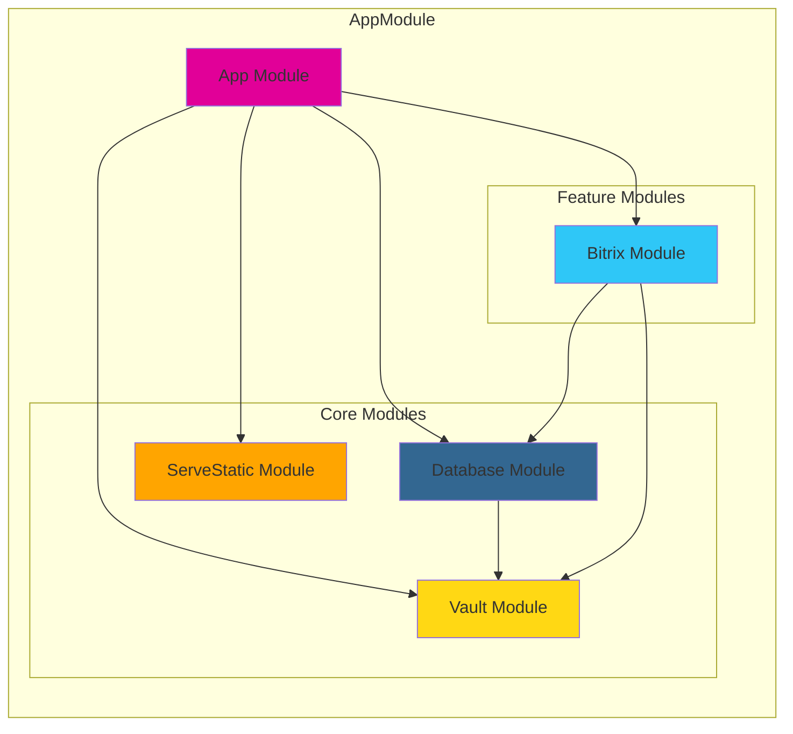
```mermaid
graph LR
    subgraph "AppModule"
        App[App Module]
        
        subgraph "Core Modules"
            Vault[Vault Module]
            DB[Database Module]
            Static[ServeStatic Module]
        end
        
        subgraph "Feature Modules"
            Bitrix[Bitrix Module]
        end
    end
    
    App --> Vault
    App --> DB
    App --> Static
    App --> Bitrix
    
    DB --> Vault
    Bitrix --> DB
    Bitrix --> Vault
    
    style App fill:#E10098
    style Vault fill:#FFD814
    style DB fill:#336791
    style Bitrix fill:#2FC7F7
    style Static fill:#FFA500
```

### Bitrix Module - Детальная структура

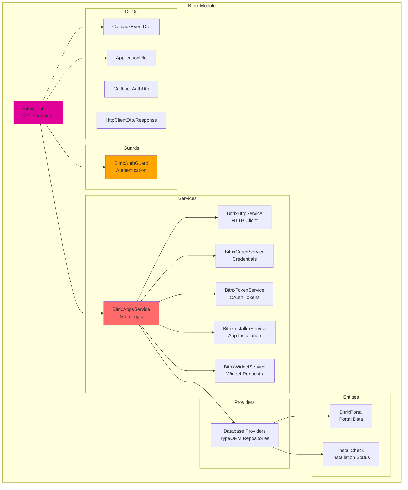
```mermaid
graph TB
    subgraph "Bitrix Module"
        Controller[BitrixController<br/>API Endpoints]
        
        subgraph "Services"
            AppsService[BitrixAppsService<br/>Main Logic]
            HttpService[BitrixHttpService<br/>HTTP Client]
            CreedService[BitrixCreedService<br/>Credentials]
            TokenService[BitrixTokenService<br/>OAuth Tokens]
            InstallerService[BitrixInstallerService<br/>App Installation]
            WidgetService[BitrixWidgetService<br/>Widget Requests]
        end
        
        subgraph "Guards"
            AuthGuard[BitrixAuthGuard<br/>Authentication]
        end
        
        subgraph "Providers"
            DBProviders[Database Providers<br/>TypeORM Repositories]
        end
        
        subgraph "Entities"
            Portal[BitrixPortal<br/>Portal Data]
            InstallCheck[InstallCheck<br/>Installation Status]
        end
        
        subgraph "DTOs"
            CallbackEvent[CallbackEventDto]
            Application[ApplicationDto]
            Auth[CallbackAuthDto]
            HTTP[HttpClientDto/Response]
        end
    end
    
    Controller --> AuthGuard
    Controller --> AppsService
    AppsService --> HttpService
    AppsService --> CreedService
    AppsService --> TokenService
    AppsService --> InstallerService
    AppsService --> WidgetService
    
    AppsService --> DBProviders
    DBProviders --> Portal
    DBProviders --> InstallCheck
    
    Controller -.-> CallbackEvent
    Controller -.-> Application
    
    style Controller fill:#E10098
    style AppsService fill:#FF6B6B
    style AuthGuard fill:#FFA500
```

---

## Потоки данных

### 1. Процесс установки приложения в Bitrix24

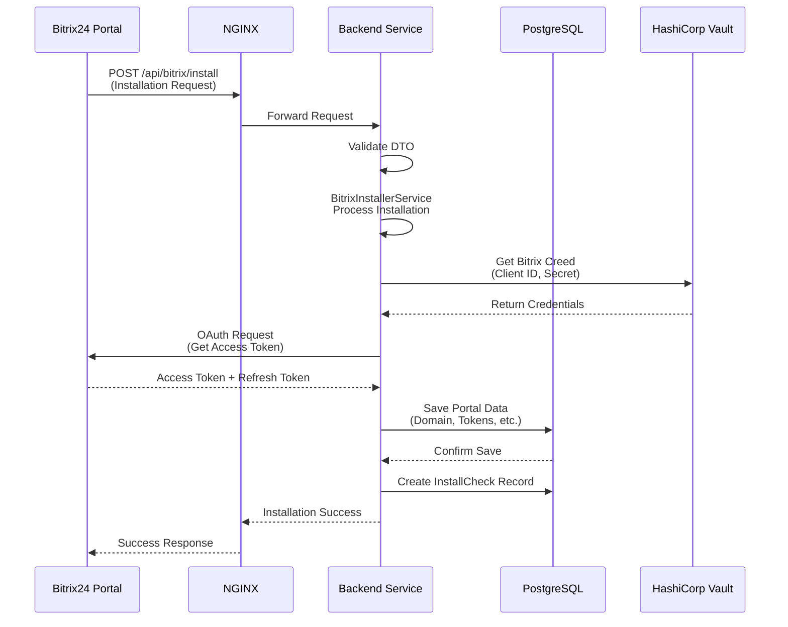
```mermaid
sequenceDiagram
    participant B24 as Bitrix24 Portal
    participant NGINX as NGINX
    participant Backend as Backend Service
    participant DB as PostgreSQL
    participant Vault as HashiCorp Vault
    
    B24->>NGINX: POST /api/bitrix/install<br/>(Installation Request)
    NGINX->>Backend: Forward Request
    Backend->>Backend: Validate DTO
    Backend->>Backend: BitrixInstallerService<br/>Process Installation
    Backend->>Vault: Get Bitrix Creed<br/>(Client ID, Secret)
    Vault-->>Backend: Return Credentials
    Backend->>B24: OAuth Request<br/>(Get Access Token)
    B24-->>Backend: Access Token + Refresh Token
    Backend->>DB: Save Portal Data<br/>(Domain, Tokens, etc.)
    DB-->>Backend: Confirm Save
    Backend->>DB: Create InstallCheck Record
    Backend-->>NGINX: Installation Success
    NGINX-->>B24: Success Response
```

### 2. Обработка callback событий от Bitrix24

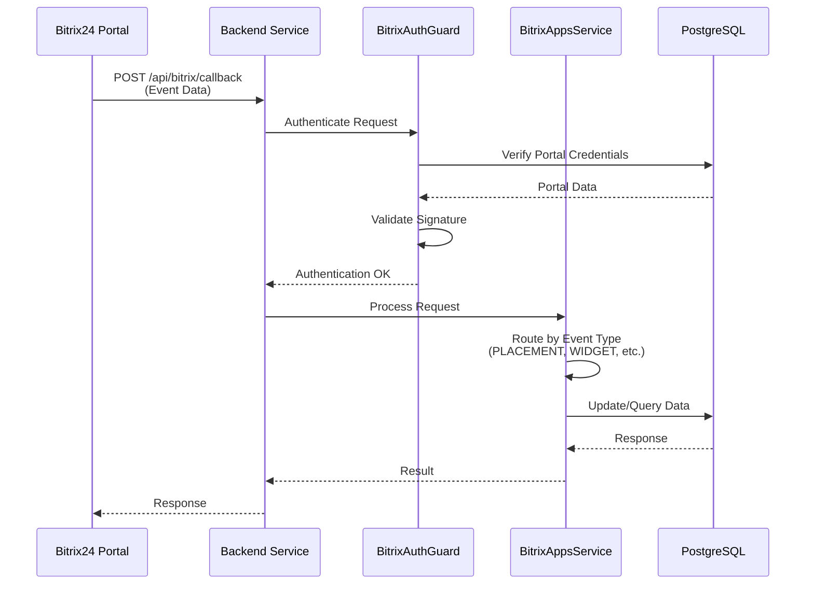
```mermaid
sequenceDiagram
    participant B24 as Bitrix24 Portal
    participant Backend as Backend Service
    participant Guard as BitrixAuthGuard
    participant Service as BitrixAppsService
    participant DB as PostgreSQL
    
    B24->>Backend: POST /api/bitrix/callback<br/>(Event Data)
    Backend->>Guard: Authenticate Request
    Guard->>DB: Verify Portal Credentials
    DB-->>Guard: Portal Data
    Guard->>Guard: Validate Signature
    Guard-->>Backend: Authentication OK
    Backend->>Service: Process Request
    Service->>Service: Route by Event Type<br/>(PLACEMENT, WIDGET, etc.)
    Service->>DB: Update/Query Data
    DB-->>Service: Response
    Service-->>Backend: Result
    Backend-->>B24: Response
```

### 3. Работа виджета и совершение звонка

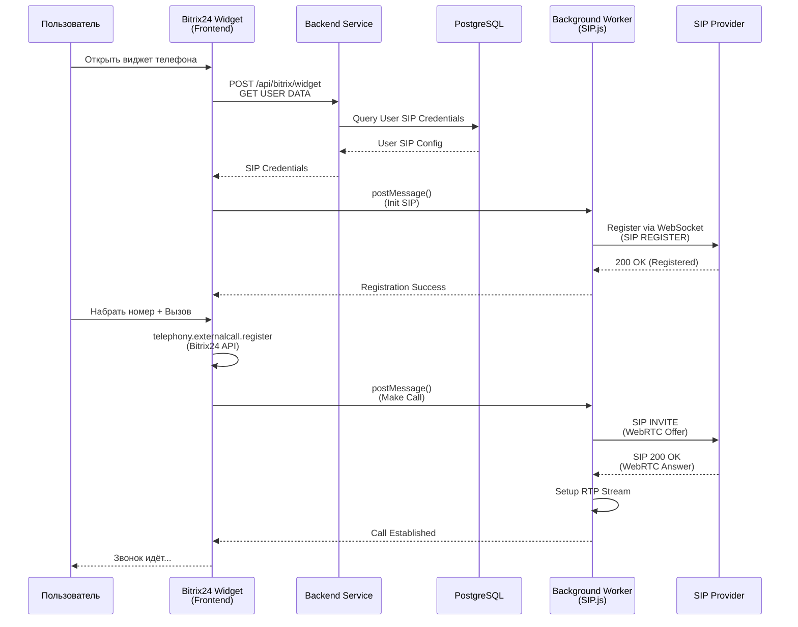
```mermaid
sequenceDiagram
    participant User as Пользователь
    participant Widget as Bitrix24 Widget<br/>(Frontend)
    participant Backend as Backend Service
    participant DB as PostgreSQL
    participant BGWorker as Background Worker<br/>(SIP.js)
    participant SIP as SIP Provider
    
    User->>Widget: Открыть виджет телефона
    Widget->>Backend: POST /api/bitrix/widget<br/>GET USER DATA
    Backend->>DB: Query User SIP Credentials
    DB-->>Backend: User SIP Config
    Backend-->>Widget: SIP Credentials
    Widget->>BGWorker: postMessage()<br/>(Init SIP)
    BGWorker->>SIP: Register via WebSocket<br/>(SIP REGISTER)
    SIP-->>BGWorker: 200 OK (Registered)
    BGWorker-->>Widget: Registration Success
    
    User->>Widget: Набрать номер + Вызов
    Widget->>Widget: telephony.externalcall.register<br/>(Bitrix24 API)
    Widget->>BGWorker: postMessage()<br/>(Make Call)
    BGWorker->>SIP: SIP INVITE<br/>(WebRTC Offer)
    SIP-->>BGWorker: SIP 200 OK<br/>(WebRTC Answer)
    BGWorker->>BGWorker: Setup RTP Stream
    BGWorker-->>Widget: Call Established
    Widget-->>User: Звонок идёт...
```

### 4. Инициализация секретов через Vault

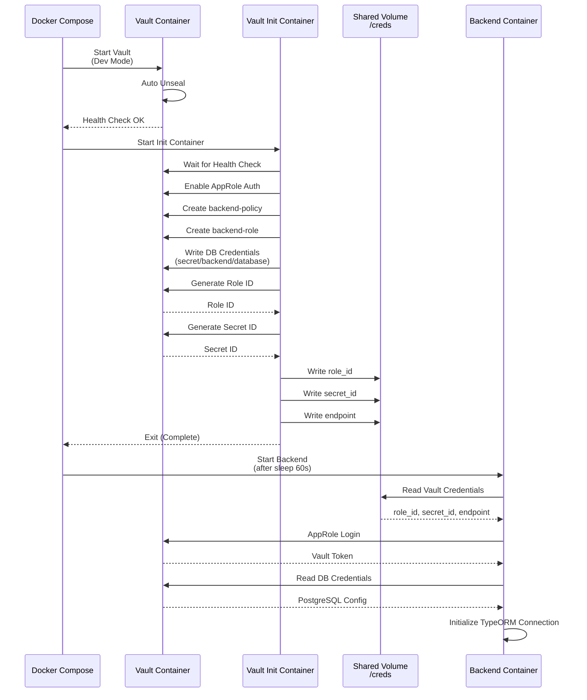
```mermaid
sequenceDiagram
    participant Compose as Docker Compose
    participant Vault as Vault Container
    participant VaultInit as Vault Init Container
    participant SharedVol as Shared Volume<br/>/creds
    participant Backend as Backend Container
    
    Compose->>Vault: Start Vault<br/>(Dev Mode)
    Vault->>Vault: Auto Unseal
    Vault-->>Compose: Health Check OK
    
    Compose->>VaultInit: Start Init Container
    VaultInit->>Vault: Wait for Health Check
    VaultInit->>Vault: Enable AppRole Auth
    VaultInit->>Vault: Create backend-policy
    VaultInit->>Vault: Create backend-role
    VaultInit->>Vault: Write DB Credentials<br/>(secret/backend/database)
    VaultInit->>Vault: Generate Role ID
    Vault-->>VaultInit: Role ID
    VaultInit->>Vault: Generate Secret ID
    Vault-->>VaultInit: Secret ID
    VaultInit->>SharedVol: Write role_id
    VaultInit->>SharedVol: Write secret_id
    VaultInit->>SharedVol: Write endpoint
    VaultInit-->>Compose: Exit (Complete)
    
    Compose->>Backend: Start Backend<br/>(after sleep 60s)
    Backend->>SharedVol: Read Vault Credentials
    SharedVol-->>Backend: role_id, secret_id, endpoint
    Backend->>Vault: AppRole Login
    Vault-->>Backend: Vault Token
    Backend->>Vault: Read DB Credentials
    Vault-->>Backend: PostgreSQL Config
    Backend->>Backend: Initialize TypeORM Connection
```

---

## Структура базы данных

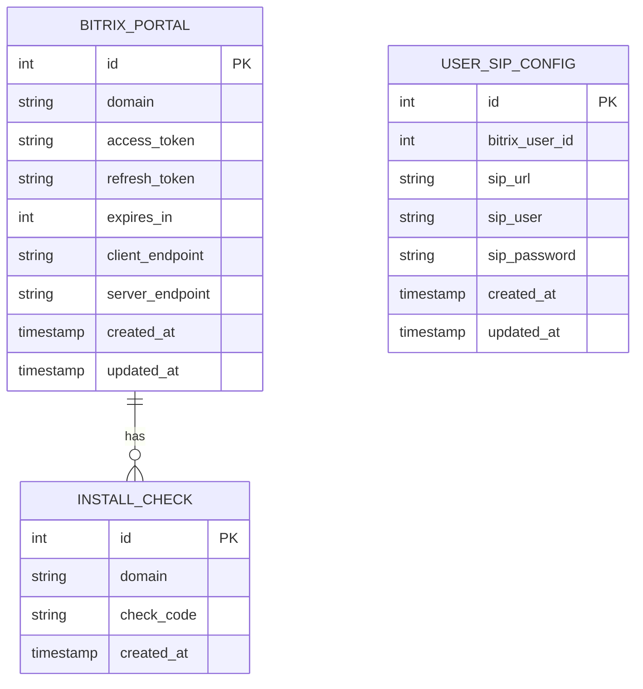
```mermaid
erDiagram
    BITRIX_PORTAL ||--o{ INSTALL_CHECK : has
    BITRIX_PORTAL {
        int id PK
        string domain
        string access_token
        string refresh_token
        int expires_in
        string client_endpoint
        string server_endpoint
        timestamp created_at
        timestamp updated_at
    }
    
    INSTALL_CHECK {
        int id PK
        string domain
        string check_code
        timestamp created_at
    }
    
    USER_SIP_CONFIG {
        int id PK
        int bitrix_user_id
        string sip_url
        string sip_user
        string sip_password
        timestamp created_at
        timestamp updated_at
    }
```

---

## Структура Frontend приложений

### Widget Application

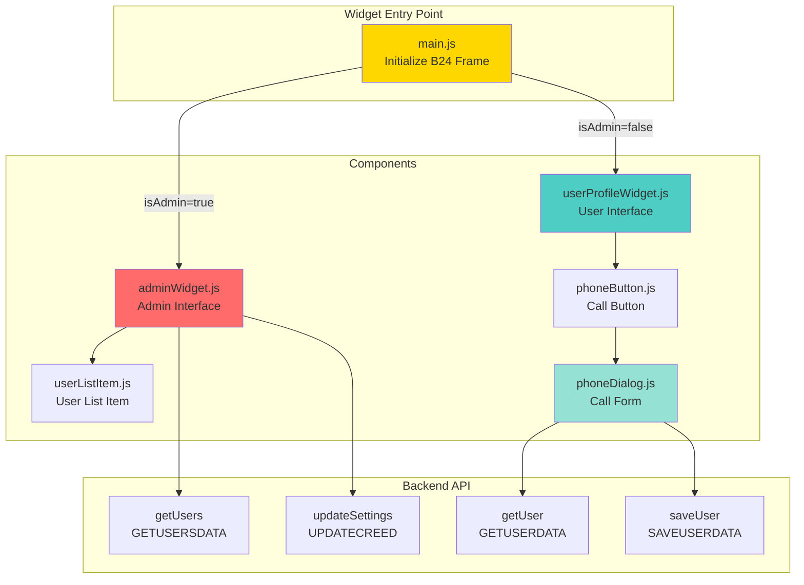
```mermaid
graph TB
    subgraph "Widget Entry Point"
        Main[main.js<br/>Initialize B24 Frame]
    end
    
    subgraph "Components"
        AdminWidget[adminWidget.js<br/>Admin Interface]
        UserWidget[userProfileWidget.js<br/>User Interface]
        PhoneButton[phoneButton.js<br/>Call Button]
        PhoneDialog[phoneDialog.js<br/>Call Form]
        UserListItem[userListItem.js<br/>User List Item]
    end
    
    subgraph "Backend API"
        UpdateSettings[updateSettings<br/>UPDATECREED]
        GetUser[getUser<br/>GETUSERDATA]
        SaveUser[saveUser<br/>SAVEUSERDATA]
        GetUsers[getUsers<br/>GETUSERSDATA]
    end
    
    Main -->|isAdmin=true| AdminWidget
    Main -->|isAdmin=false| UserWidget
    
    AdminWidget --> UserListItem
    AdminWidget --> GetUsers
    AdminWidget --> UpdateSettings
    
    UserWidget --> PhoneButton
    PhoneButton --> PhoneDialog
    
    PhoneDialog --> GetUser
    PhoneDialog --> SaveUser
    
    style Main fill:#FFD700
    style AdminWidget fill:#FF6B6B
    style UserWidget fill:#4ECDC4
    style PhoneDialog fill:#95E1D3
```

### Background Worker (SIP Client)

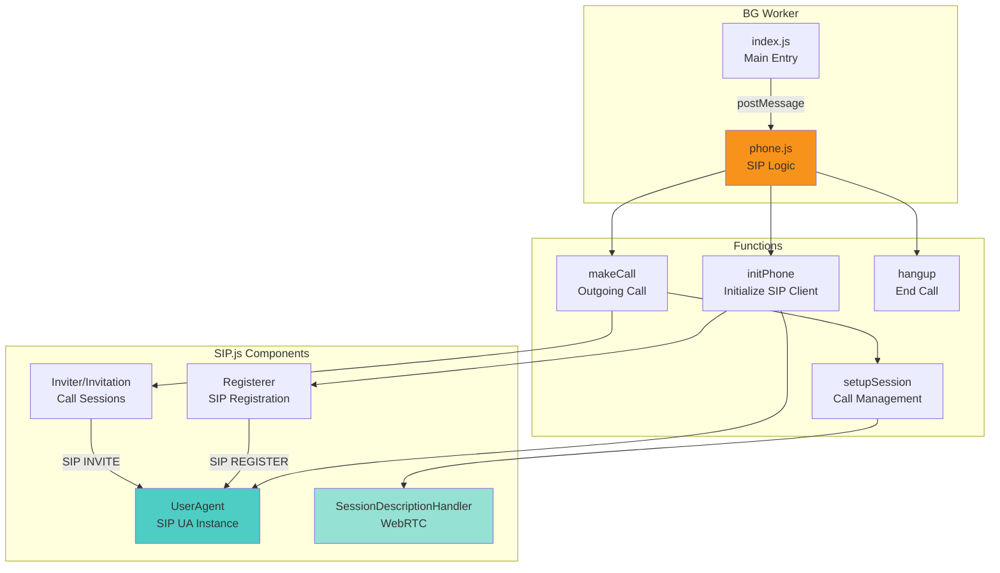
```mermaid
graph TB
    subgraph "BG Worker"
        Index[index.js<br/>Main Entry]
        Phone[phone.js<br/>SIP Logic]
    end
    
    subgraph "SIP.js Components"
        UA[UserAgent<br/>SIP UA Instance]
        Registerer[Registerer<br/>SIP Registration]
        Inviter[Inviter/Invitation<br/>Call Sessions]
        SDH[SessionDescriptionHandler<br/>WebRTC]
    end
    
    subgraph "Functions"
        InitPhone[initPhone<br/>Initialize SIP Client]
        MakeCall[makeCall<br/>Outgoing Call]
        Hangup[hangup<br/>End Call]
        SetupSession[setupSession<br/>Call Management]
    end
    
    Index -->|postMessage| Phone
    Phone --> InitPhone
    Phone --> MakeCall
    Phone --> Hangup
    
    InitPhone --> UA
    InitPhone --> Registerer
    
    MakeCall --> Inviter
    MakeCall --> SetupSession
    
    SetupSession --> SDH
    
    Registerer -->|SIP REGISTER| UA
    Inviter -->|SIP INVITE| UA
    
    style Phone fill:#F7931A
    style UA fill:#4ECDC4
    style SDH fill:#95E1D3
```

---

## Сетевая архитектура

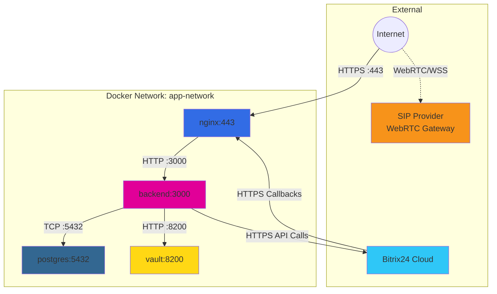
```mermaid
graph TB
    subgraph "External"
        Internet((Internet))
        B24Cloud[Bitrix24 Cloud]
        SIPProvider[SIP Provider<br/>WebRTC Gateway]
    end
    
    subgraph "Docker Network: app-network"
        NGINX[nginx:443]
        Backend[backend:3000]
        Postgres[postgres:5432]
        Vault[vault:8200]
    end
    
    Internet -->|HTTPS :443| NGINX
    NGINX -->|HTTP :3000| Backend
    Backend -->|TCP :5432| Postgres
    Backend -->|HTTP :8200| Vault
    
    B24Cloud -->|HTTPS Callbacks| NGINX
    Backend -->|HTTPS API Calls| B24Cloud
    
    Internet -.->|WebRTC/WSS| SIPProvider
    
    style NGINX fill:#326CE5
    style Backend fill:#E10098
    style Postgres fill:#336791
    style Vault fill:#FFD814
    style B24Cloud fill:#2FC7F7
    style SIPProvider fill:#F7931A
```

---

## API Endpoints

### Backend REST API

| Метод | Путь | Описание | Guard |
|-------|------|----------|-------|
| POST | `/api/bitrix/install` | Установка приложения в Bitrix24 | ❌ |
| POST | `/api/bitrix/callback` | Обработка событий от Bitrix24 | ✅ BitrixAuthGuard |
| POST | `/api/bitrix/widget` | Обработка запросов от виджета | ❌ (TODO) |

### Widget Backend API (Internal)

| Событие | Параметры | Описание |
|---------|-----------|----------|
| `UPDATECREED` | `clientId`, `secretId` | Обновить учетные данные Bitrix24 |
| `GETUSERDATA` | `userId` | Получить данные пользователя (SIP) |
| `SAVEUSERDATA` | `userId`, `url`, `user`, `password` | Сохранить SIP учетные данные пользователя |
| `GETUSERSDATA` | `usersId` | Получить данные нескольких пользователей |

---

## Жизненный цикл приложения

### Запуск системы

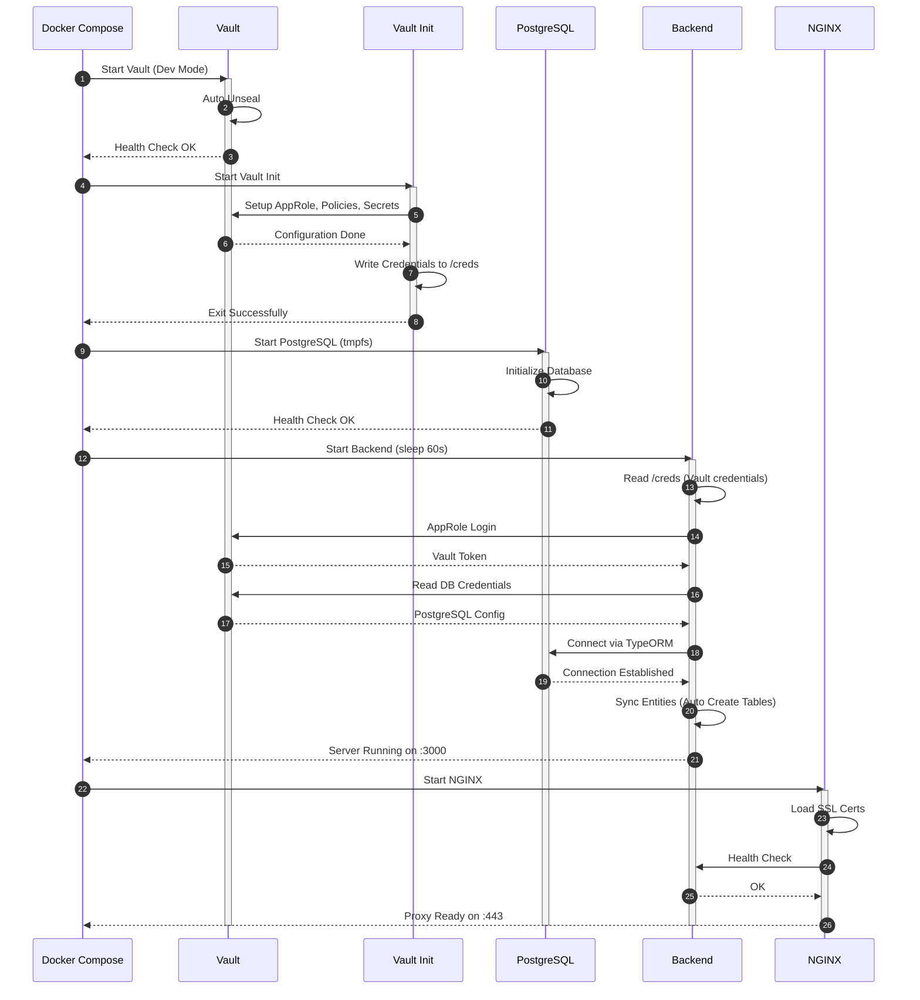
```mermaid
sequenceDiagram
    autonumber
    participant DC as Docker Compose
    participant V as Vault
    participant VI as Vault Init
    participant PG as PostgreSQL
    participant BE as Backend
    participant NG as NGINX
    
    DC->>V: Start Vault (Dev Mode)
    activate V
    V->>V: Auto Unseal
    V-->>DC: Health Check OK
    
    DC->>VI: Start Vault Init
    activate VI
    VI->>V: Setup AppRole, Policies, Secrets
    V-->>VI: Configuration Done
    VI->>VI: Write Credentials to /creds
    VI-->>DC: Exit Successfully
    deactivate VI
    
    DC->>PG: Start PostgreSQL (tmpfs)
    activate PG
    PG->>PG: Initialize Database
    PG-->>DC: Health Check OK
    
    DC->>BE: Start Backend (sleep 60s)
    activate BE
    BE->>BE: Read /creds (Vault credentials)
    BE->>V: AppRole Login
    V-->>BE: Vault Token
    BE->>V: Read DB Credentials
    V-->>BE: PostgreSQL Config
    BE->>PG: Connect via TypeORM
    PG-->>BE: Connection Established
    BE->>BE: Sync Entities (Auto Create Tables)
    BE-->>DC: Server Running on :3000
    
    DC->>NG: Start NGINX
    activate NG
    NG->>NG: Load SSL Certs
    NG->>BE: Health Check
    BE-->>NG: OK
    NG-->>DC: Proxy Ready on :443
    deactivate NG
    deactivate BE
    deactivate PG
    deactivate V
```

---

## Безопасность

### Текущее состояние (Dev/Test)

⚠️ **Важно:** Текущая конфигурация предназначена для разработки и тестирования:

1. **Vault** работает в dev-режиме без персистентности
2. **PostgreSQL** использует tmpfs (данные не сохраняются)
3. **Отсутствует авторизация** между Backend и статикой виджета
4. **Нет валидации запросов** между Backend и статикой
5. **Отладочные логи** могут выводить секреты

### Защитные механизмы

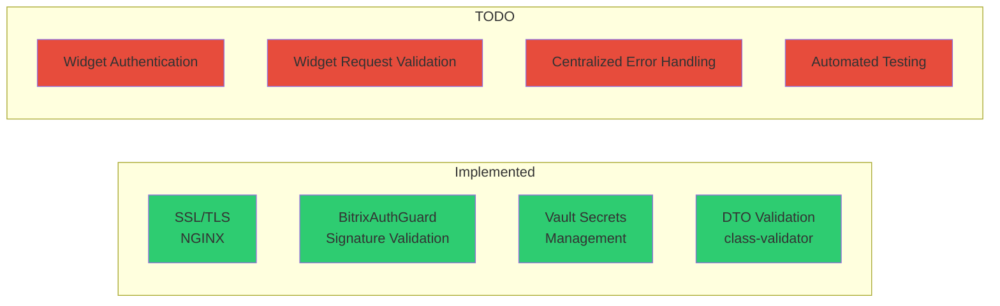
```mermaid
graph LR
    subgraph "Implemented"
        SSL[SSL/TLS<br/>NGINX]
        Guard[BitrixAuthGuard<br/>Signature Validation]
        Vault[Vault Secrets<br/>Management]
        DTO[DTO Validation<br/>class-validator]
    end
    
    subgraph "TODO"
        WidgetAuth[Widget Authentication]
        WidgetValidation[Widget Request Validation]
        ErrorHandling[Centralized Error Handling]
        Tests[Automated Testing]
    end
    
    style SSL fill:#2ECC71
    style Guard fill:#2ECC71
    style Vault fill:#2ECC71
    style DTO fill:#2ECC71
    
    style WidgetAuth fill:#E74C3C
    style WidgetValidation fill:#E74C3C
    style ErrorHandling fill:#E74C3C
    style Tests fill:#E74C3C
```

---

## Особенности реализации

### 1. Раздача статики через Backend

**Проблема:** Bitrix24 запрашивает страницы виджетов через POST-запросы.

**Решение:** Статика раздается через NestJS `ServeStaticModule` вместо NGINX, так как заставить веб-серверы (кроме Apache) раздавать статику по POST методу затруднительно.

### 2. Временное хранилище данных

- **Vault:** Dev-режим, данные в памяти
- **PostgreSQL:** tmpfs, данные теряются при рестарте

**Причина:** Упрощение development/testing окружения.

### 3. Связь между контейнерами

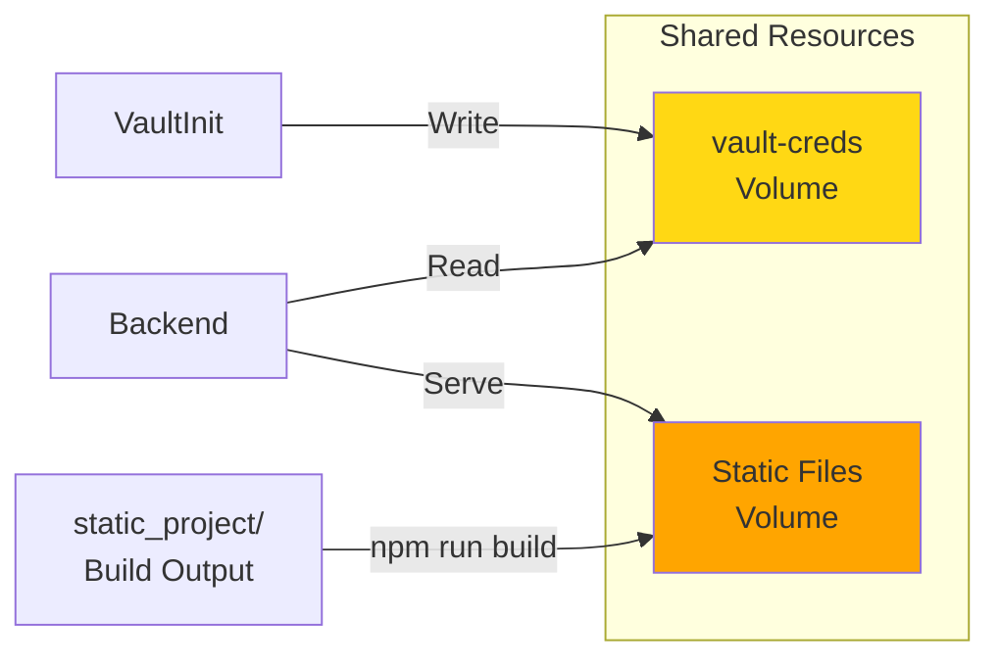
```mermaid
graph LR
    subgraph "Shared Resources"
        VaultCreds[vault-creds<br/>Volume]
        StaticVol[Static Files<br/>Volume]
    end
    
    VaultInit -->|Write| VaultCreds
    Backend -->|Read| VaultCreds
    
    StaticProject[static_project/<br/>Build Output]
    StaticProject -->|npm run build| StaticVol
    Backend -->|Serve| StaticVol
    
    style VaultCreds fill:#FFD814
    style StaticVol fill:#FFA500
```

---

## Точки расширения

### 1. Добавление авторизации виджета

```typescript
// backend/src/bitrix/guards/widget.auth.guard.ts
@Injectable()
export class WidgetAuthGuard implements CanActivate {
  canActivate(context: ExecutionContext): boolean {
    const request = context.switchToHttp().getRequest();
    // Validate widget request signature
    // Check user session/token
    return true;
  }
}
```

### 2. Централизованная обработка ошибок

```typescript
// backend/src/common/filters/http-exception.filter.ts
@Catch()
export class AllExceptionsFilter implements ExceptionFilter {
  catch(exception: unknown, host: ArgumentsHost) {
    // Unified error response format
    // Logging
    // Error tracking integration
  }
}
```

### 3. Интеграция тестирования

```typescript
// backend/test/bitrix/bitrix.e2e-spec.ts
describe('Bitrix Integration (e2e)', () => {
  it('/api/bitrix/install (POST)', () => {
    // Test installation flow
  });
  
  it('/api/bitrix/callback (POST)', () => {
    // Test callback handling with signature
  });
});
```

---

## Мониторинг и отладка

### Логирование

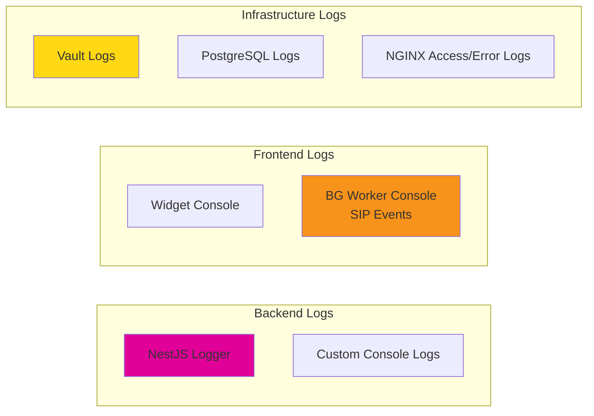
```mermaid
graph LR
    subgraph "Backend Logs"
        NestLogger[NestJS Logger]
        CustomLogs[Custom Console Logs]
    end
    
    subgraph "Frontend Logs"
        WidgetConsole[Widget Console]
        BGWorkerConsole[BG Worker Console<br/>SIP Events]
    end
    
    subgraph "Infrastructure Logs"
        VaultLogs[Vault Logs]
        PostgresLogs[PostgreSQL Logs]
        NginxLogs[NGINX Access/Error Logs]
    end
    
    style NestLogger fill:#E10098
    style BGWorkerConsole fill:#F7931A
    style VaultLogs fill:#FFD814
```

### Команды для отладки

```bash
# Просмотр логов всех сервисов
docker compose logs -f

# Логи конкретного сервиса
docker compose logs -f backend
docker compose logs -f vault

# Проверка состояния Vault
docker exec -it vault vault status

# Подключение к PostgreSQL
docker exec -it postgres psql -U app_db -d app_db

# Просмотр Vault секретов (dev mode)
docker exec -it vault vault kv get secret/backend/database
```

---

## Диаграмма развертывания

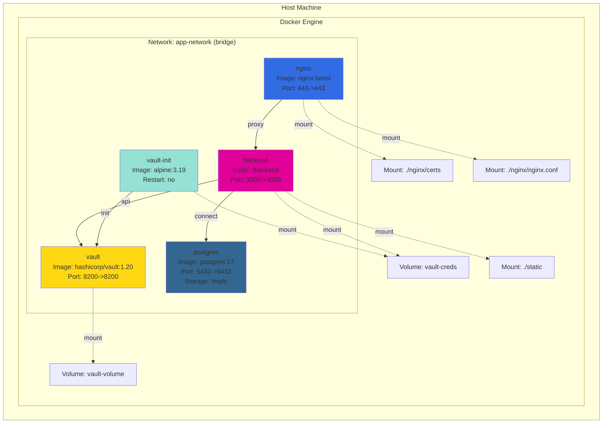
```mermaid
graph TB
    subgraph "Host Machine"
        subgraph "Docker Engine"
            subgraph "Network: app-network (bridge)"
                N1[nginx<br/>Image: nginx:latest<br/>Port: 443->443]
                N2[backend<br/>Build: ./backend<br/>Port: 3000->3000]
                N3[postgres<br/>Image: postgres:17<br/>Port: 5432->5432<br/>Storage: tmpfs]
                N4[vault<br/>Image: hashicorp/vault:1.20<br/>Port: 8200->8200]
                N5[vault-init<br/>Image: alpine:3.19<br/>Restart: no]
            end
            
            V1[Volume: vault-volume]
            V2[Volume: vault-creds]
            V3[Mount: ./static]
            V4[Mount: ./nginx/certs]
            V5[Mount: ./nginx/nginx.conf]
        end
    end
    
    N4 -.->|mount| V1
    N5 -.->|mount| V2
    N2 -.->|mount| V2
    N2 -.->|mount| V3
    N1 -.->|mount| V4
    N1 -.->|mount| V5
    
    N1 -->|proxy| N2
    N2 -->|connect| N3
    N2 -->|api| N4
    N5 -->|init| N4
    
    style N1 fill:#326CE5
    style N2 fill:#E10098
    style N3 fill:#336791
    style N4 fill:#FFD814
    style N5 fill:#95E1D3
```

---

## Заключение

Проект представляет собой полнофункциональную интеграцию WebRTC SIP телефонии с Bitrix24, построенную на современных технологиях и лучших практиках разработки. Микросервисная архитектура с использованием Docker обеспечивает изолированность компонентов и упрощает развертывание.

### Ключевые архитектурные решения:

1. **Модульность** - чёткое разделение ответственности между модулями NestJS
2. **Безопасность** - использование Vault для управления секретами
3. **Масштабируемость** - контейнеризация позволяет легко масштабировать отдельные компоненты
4. **Разделение Frontend/Backend** - widget и bg_worker работают независимо друг от друга

### Направления развития:

- ✅ Реализация полноценной авторизации виджетов
- ✅ Добавление валидации и обработки ошибок
- ✅ Настройка production-ready конфигурации Vault и PostgreSQL
- ✅ Интеграция автоматического тестирования
- ✅ Добавление системы мониторинга и алертинга

